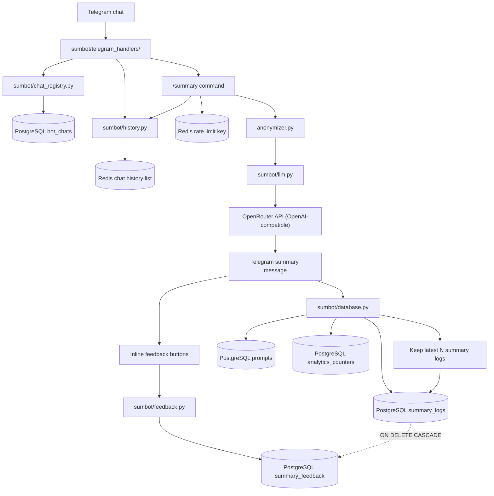
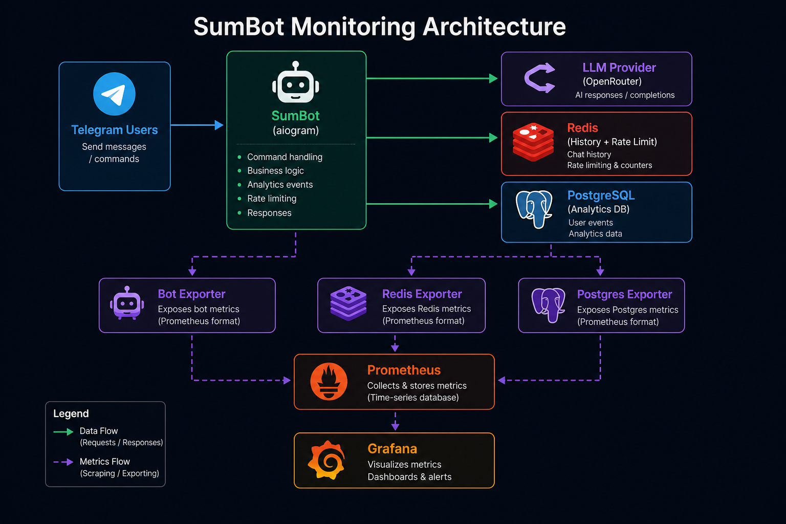

# SumBot Architecture

Этот документ - короткая карта проекта. Его цель не заменить README, а помочь быстро понять, где что живет и как данные проходят через систему.

## Mental Model

SumBot - Telegram-бот для пересказа чатов.

Главный путь:

```text
Telegram update
  -> aiogram handlers
  -> Redis chat history
  -> anonymizer
  -> LLM
  -> Telegram summary message
  -> PostgreSQL analytics
```

Бот хранит два разных вида данных:

- Redis: короткая оперативная история сообщений чата для будущих `/summary`.
- PostgreSQL: аналитика по сгенерированным summary, feedback и публичным чатам.

## Visual Map



Architecture image (for quick preview in viewers where Mermaid is disabled):



Коротко: Redis - рабочая память для будущего пересказа, PostgreSQL - analytics. Чистка касается только таблицы `summary_logs` и связанных с ней feedback-строк, но не Redis-истории и не счетчика общего количества summary.

## Entry Points

| Файл | Роль |
| --- | --- |
| `bot.py` | Минимальная точка входа, вызывает `sumbot.app.main()`. |
| `sumbot/app.py` | Создает `Bot`, `Dispatcher`, services, регистрирует handlers и запускает polling. |
| `config.py` | Читает `.env`, хранит Telegram token, DB URL, Redis host, модель и часть настроек. |
| `sumbot/constants.py` | Технические константы: лимиты, таймауты, rate limit, retention analytics. |

## Runtime Services

`sumbot/services.py` собирает зависимости в `BotServices`:

| Сервис | Где используется | Зачем |
| --- | --- | --- |
| `Redis` | `history.py`, `telegram_handlers/` | Хранить последние сообщения чата и rate limit. |
| `AsyncOpenAI` | `llm.py` через `telegram_handlers/summary.py` | Делать запросы к OpenRouter/OpenAI-compatible API. |
| `AsyncEngine` | `database.py`, `feedback.py`, `chat_registry.py` | Писать аналитику и registry в PostgreSQL. |

## Main Modules

| Файл | Ответственность |
| --- | --- |
| `sumbot/telegram_handlers/registry.py` | Собирает регистрацию Telegram handlers и lifecycle-сценарии. |
| `sumbot/telegram_handlers/summary.py` | `/summary`, rate limit, LLM fallback и отправка итогового сообщения. |
| `sumbot/telegram_handlers/debug_handlers.py` | `/debug` и callbacks настроек текущего чата. |
| `sumbot/telegram_handlers/debug_panel.py` | Чистое построение текста и клавиатуры `/debug`. |
| `sumbot/telegram_handlers/debug_runtime.py` | Сбор runtime-данных и обновление debug-сообщения. |
| `sumbot/telegram_handlers/debug_message_lifecycle.py` | Связь исходной команды с debug-сообщением и их удаление. |
| `sumbot/telegram_handlers/prompt_profile_handlers.py` | Команды `/prompt`, `/prompt_builder` и callbacks prompt-панели. |
| `sumbot/telegram_handlers/prompt_profile_panel.py` | Тексты и клавиатуры выбора prompt profile. |
| `sumbot/telegram_handlers/admin_chat_handlers.py` | `/debug_chat_settings` и callbacks управления выбранным чатом. |
| `sumbot/telegram_handlers/admin_chat_panel.py` | Parsing, тексты и клавиатуры admin chat settings. |
| `sumbot/telegram_handlers/admin_chat_runtime.py` | Загрузка chat metadata и обновление admin chat сообщения. |
| `sumbot/telegram_handlers/settings_panel.py` | Общие controls и форматирование generation settings. |
| `sumbot/telegram_handlers/reminders.py` | `/debug_chats`, `/debug_remind_chats` и cooldown рассылки. |
| `sumbot/telegram_handlers/feedback_details.py` | Feedback callbacks, уточнения к плохим оценкам и catch-all history. |
| `sumbot/history.py` | Запись сообщений в Redis и выборка истории для summary. |
| `sumbot/llm.py` | Загрузка prompt, вызов LLM, retry, подготовка финального Telegram HTML. |
| `anonymizer.py` | Анонимизация входного текста для LLM и обратная подстановка имен в ответе. |
| `sumbot/database.py` | SQL-операции для `summary_logs`, counters и `summary_feedback`. |
| `sumbot/feedback.py` | Inline-кнопки feedback и сохранение оценки к summary. |
| `sumbot/chat_registry.py` | Сохранение публичных чатов, где был замечен бот. |
| `sumbot/logging_setup.py` | Настройка Python logging. |

### Debug And Admin Boundaries

Debug-интерфейсы разделены по пользовательским сценариям: текущий чат, prompt profiles и управление другим чатом. Для каждого сценария handlers отвечают только за aiogram orchestration, panel-модули строят Telegram presentation, а runtime-модули выполняют Redis/DB/Telegram I/O. Общие generation controls находятся в `settings_panel.py`, callback data - в `debug_constants.py`.

## Summary Flow

1. Любое обычное текстовое сообщение попадает в catch-all handler в `sumbot/telegram_handlers/feedback_details.py`.
2. Handler вызывает `save_chat_snapshot(...)`, чтобы обновить registry публичных чатов.
3. Handler вызывает `save_message_to_history(...)`, чтобы положить сообщение в Redis list `chat:{chat_id}:log`.
4. Redis list обрезается до `config.ChatConfig.HISTORY_LIMIT`.
5. Пользователь вызывает `/summary`.
6. `acquire_summary_rate_limit(...)` проверяет Redis rate limit.
7. `parse_summary_request(...)` решает, брать последние 24 часа или последние N сообщений.
8. `fetch_messages_for_summary(...)` достает сообщения из Redis в хронологическом порядке.
9. `prepare_summary_context(...)` нормализует историю, при необходимости безопасно схлопывает короткие реплики и рендерит анонимизированный контекст для LLM.
10. `generate_summary(...)` вызывает модель.
11. `prepare_final_message(...)` декодирует имена, вычищает протекшие role-tags, экранирует HTML и добавляет disclaimer.
12. `send_summary(...)` редактирует ожидательное сообщение и добавляет feedback-кнопки.
13. `save_summary_analytics(...)` пишет аналитику в PostgreSQL.

## Feedback Flow

1. Под summary есть inline-кнопки из `build_summary_feedback_keyboard()`.
2. Callback приходит в `summary_feedback_callback(...)` в `sumbot/telegram_handlers/feedback_details.py`.
3. `parse_summary_feedback_callback(...)` превращает callback data в `feedback_value` и `sentiment`.
4. `save_feedback_for_summary(...)` ищет нужную запись в `summary_logs` по `chat_id` и `telegram_message_id`.
5. `upsert_summary_feedback(...)` делает insert/update в `summary_feedback`.

Один пользователь может иметь только один feedback на одно summary-сообщение.

## Database

PostgreSQL управляется Alembic migrations в `migrations/versions`.

Основные таблицы:

| Таблица | Что хранит |
| --- | --- |
| `prompts` | Тексты system prompt, чтобы не дублировать их в каждой записи. |
| `summary_logs` | Последние подробные записи summary: context, response, model, tokens. |
| `summary_feedback` | Оценки пользователей под summary. |
| `bot_chats` | Публичные чаты, где бот был замечен. |
| `analytics_counters` | Монотонные счетчики analytics, которые переживают чистку старых строк. |

### Analytics Retention

`summary_logs` не должна расти бесконечно. Лимит задается через:

```text
SUMMARY_LOG_RETENTION_LIMIT=200
```

При каждом новом сохранении summary происходит:

```text
increment analytics_counters.summary_logs_written
insert into summary_logs
delete old summary_logs beyond retention limit
```

Миграция `f8b7c2d9e0a1` при первом применении тоже создает счетчик из текущего `COUNT(*)` и обрезает `summary_logs` до последних `200` строк.

`summary_feedback.summary_log_id` ссылается на `summary_logs(id)` через `ON DELETE CASCADE`, поэтому feedback к удаленным старым summary удаляется автоматически.

Историческое число записанных summary не берется из `COUNT(summary_logs)`. Оно лежит в:

```text
analytics_counters.name = summary_logs_written
```

### Cleanup Script

`tools.analytics.cleanup_analytics` делает ту же обрезку вручную:

```text
connect to DATABASE_URL
count summary_logs and summary_feedback before cleanup
delete summary_logs beyond latest SUMMARY_LOG_RETENTION_LIMIT rows
count summary_logs and summary_feedback after cleanup
print deleted rows and total counter
```

По умолчанию он хранит последние `200` строк `summary_logs`, если `SUMMARY_LOG_RETENTION_LIMIT` не переопределен в `.env`.

Что важно:

- скрипт не удаляет всю таблицу `summary_logs`;
- он оставляет самые новые записи по `created_at DESC, id DESC`;
- старые записи сверх лимита удаляются навсегда из `summary_logs`;
- `summary_feedback` для удаленных summary тоже удаляется из-за `ON DELETE CASCADE`;
- `analytics_counters.summary_logs_written` не уменьшается и продолжает показывать, сколько summary было записано за все время;
- `prompts`, `bot_chats` и Redis-история этим скриптом не чистятся.

## Redis

Основные ключи:

| Key | Тип | Назначение |
| --- | --- | --- |
| `chat:{chat_id}:log` | list | Последние сообщения чата для будущего summary. |
| `rate_limit:{user_id}:{chat_id}` | string with TTL | Ограничение частоты `/summary`. |

Redis history не является долгосрочным архивом. Это рабочий буфер.

## Scripts

| Скрипт | Назначение |
| --- | --- |
| `python -m tools.analytics.export_logs` | Выгрузить analytics JSON-файлы на диск внутри контейнера. |
| `python -m tools.analytics.send_analytics` | Отправить analytics JSON-файлы в Telegram-чат `ANALYTICS_CHAT_ID`. |
| `python -m tools.analytics.cleanup_analytics` | Ручная чистка старых строк PostgreSQL analytics. |
| `check_models.py` | Диагностическая проверка моделей. |

Useful commands:

```bash
task migrate
task test
task check
```

## Docker And Tasks

`Taskfile.yml` - главный интерфейс для операций.

Tasks use `.env` and the Compose project name `sumbot`.

Примеры:

```bash
task up
task logs:bot
task migrate
task down
```

## Where To Change Things

| Нужно изменить | Куда идти |
| --- | --- |
| Текст и стиль пересказа | `prompt.md` |
| Модель, env, Redis host | `config.py`, `.env` |
| LLM retry, timeout, max tokens | `sumbot/constants.py`, `sumbot/llm.py` |
| Логика команды `/summary` | `sumbot/telegram_handlers/summary.py` |
| Как выбираются сообщения из Redis | `sumbot/history.py` |
| Что пишется в PostgreSQL analytics | `sumbot/database.py` |
| Feedback-кнопки | `sumbot/feedback.py` |
| Registry публичных чатов | `sumbot/chat_registry.py` |
| Миграции БД | `migrations/versions` |
| Экспорт analytics | `tools/analytics/` |
| Чистка analytics | `tools.analytics.cleanup_analytics`, `sumbot.database.prune_old_summary_logs` |

## Complexity Notes

Самые нагруженные места сейчас:

- `sumbot/database.py`: SQL для нескольких analytics операций.
- `README.md`: много operational knowledge.

Если проект продолжит расти, первые кандидаты на разделение:

- разделить `database.py` на `summary_repository.py`, `feedback_repository.py`, `counters_repository.py`;
- держать этот документ как короткую карту, а детали оставлять в README.
