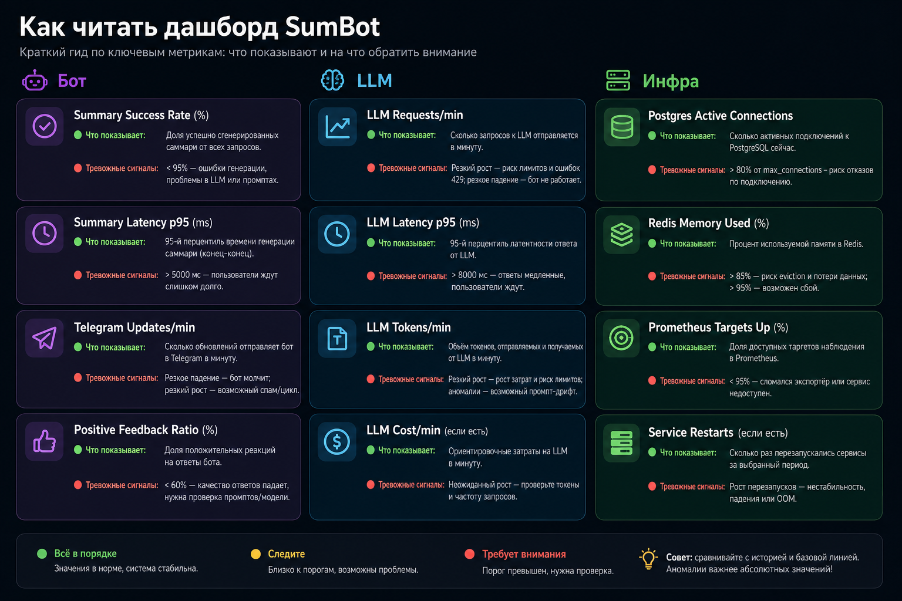

# Monitoring Guide

Этот документ расшифровывает дашборды и метрики SumBot: что показывает каждый график, где смотреть проблему и какие значения считать тревожными.



## Где Смотреть

- Grafana dashboard: `SumBot Overview`
- Источник данных: Prometheus
- Интервал для старта анализа: последние `15m` и `6h`

## Bot Metrics

| Панель | Что показывает | Нормальное поведение | Если плохо |
| --- | --- | --- | --- |
| `Summary Requests / min` | Кол-во вызовов `/summary` в минуту по `result` | Есть `success`, ошибки редкие | Рост `error`/`rate_limited`: проверить LLM и rate limit |
| `Summary Success Rate` | Доля успешных summary от всех попыток | Обычно стабильно высокая | Падает: смотреть `LLM Requests / min`, логи бота |
| `Summary Latency p50/p95` | Время полного `/summary` (не только LLM) | p95 умеренный и без резких пиков | Рост p95: узкое место в LLM, Redis, DB или Telegram API |
| `Average Source Messages` | Среднее число исходных сообщений в контексте | Колеблется от нагрузки | Резкий рост: пользователи просят длинные summary, возможен рост latency |
| `Average Rendered Turns` | Среднее число рендеренных реплик после подготовки контекста | Обычно чуть меньше source messages | Слишком высокий: проверить merge/prepare контекста |
| `Telegram Updates / min` | Общий входящий трафик апдейтов Telegram | Соответствует активности чатов | Падение в ноль при живом боте: проверить polling и токен |
| `Feedback / min` | Частота оценок `positive/neutral/negative` | Есть активность при активном использовании | Ноль при активных summary: проверить inline callbacks |
| `Positive Feedback Ratio` | Доля позитивного feedback | В идеале стабильный тренд вверх | Деградация качества summary или неудачный prompt/model |

## LLM Metrics

| Панель | Что показывает | Нормальное поведение | Если плохо |
| --- | --- | --- | --- |
| `LLM Requests / min` | Частота вызовов LLM по результатам | Большинство `success` | Рост `timeout`, `rate_limited`, `error` |
| `LLM Latency p50/p95` | Время ответа LLM | Без резких аномалий | Рост p95: проблемы провайдера/сети/слишком длинный контекст |
| `LLM Tokens / min` | Расход токенов (`input`/`output`) | Пропорционален трафику | Быстрый рост: риск роста стоимости и latency |

## Infra Metrics

| Панель | Что показывает | Нормальное поведение | Если плохо |
| --- | --- | --- | --- |
| `Postgres Active Connections` | Активные подключения к Postgres | Стабильно в разумных пределах | Рост без снижения: утечки коннектов или аномальная нагрузка |
| `Redis Memory Used` | Использование памяти Redis | Плавные изменения | Постоянный рост: проверить TTL/history limit |
| `Prometheus Targets Up` | Состояние целей scrape (`1` = up) | Все ключевые таргеты `1` | `0`: конкретный сервис недоступен для Prometheus |

## Быстрый Алгоритм Диагностики

1. Проверить `Prometheus Targets Up`.
2. Проверить `Summary Success Rate`.
3. Если success rate падает, смотреть `LLM Requests / min` и `LLM Latency p95`.
4. Если latency высокая, проверить `Average Source Messages` и `LLM Tokens / min`.
5. Если включен tracing, открыть Jaeger на `http://localhost:16686`, выбрать service `sumbot` и разобрать конкретный медленный trace.
6. Если всё технически green, но `Positive Feedback Ratio` падает, смотреть prompt/model.

## Tracing

Для разборов конкретного медленного `/summary` можно включить OpenTelemetry tracing:

```env
TRACING_ENABLED=true
TRACING_OTLP_ENDPOINT=http://jaeger:4318/v1/traces
TRACING_SAMPLE_RATIO=1.0
```

Jaeger в `docker-compose.yml` принимает OTLP HTTP на `4318` внутри compose-сети и публикует UI на `127.0.0.1:16686`.
Трассы не содержат текст сообщений или prompt; в spans пишутся только технические атрибуты: размеры контекста, модель, попытка, result, token counts и durations.

Экспорт трасс из локального или проброшенного Jaeger:

```bash
python3 scripts/export_jaeger_traces.py --lookback 1h --limit 20
python3 scripts/export_jaeger_traces.py --slowest --lookback 24h --limit 100
python3 scripts/export_jaeger_traces.py --trace-id f2bc9f9dbc6d0abf2b9c36e2c8236449
```

По умолчанию экспорт идет из `http://127.0.0.1:16686` в `artifacts/traces/*.json`.
Для другого адреса используй `--jaeger-url http://host:16686`.
Текущий `jaegertracing/all-in-one` хранит трассы в памяти, поэтому такой экспорт подходит для разбора свежих инцидентов, но не для долговременного архива.

## Минимальный Набор Алертов

1. `Summary Success Rate < 0.9` за 10 минут.
2. `LLM timeout + rate_limited` выше порога за 5 минут.
3. `Prometheus target down` дольше 2-3 минут.
4. `Redis memory` устойчиво растет длительное время.
